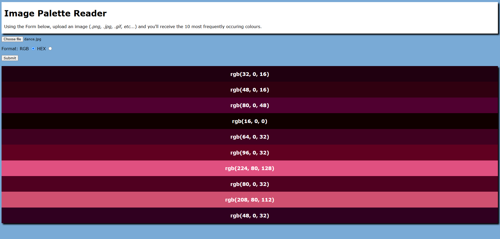

# flask image palette reader (WIP)
A Flask app that scans an uploaded image and returns a palette of the most prevalent colours.


## Local Installation: 


Using the following Bash commands, you can install the app and it run it at http://localhost:8000 (<i>requirements.txt is yet to be made as this project is incomplete</i>)

```shell
# 1. clone the repo:
$ git clone https://github.com/jacobrussell-eng/flask-image-palette-reader.git
$ cd flask-image-palette-reader

# 2. install Python packages:
$ pip install -r requirements.txt

# 3. run:
$ python app.py
```

## Resources:
- Numpy
- Pillow (PIL)
- Relative Luminance Formula - [Wikipedia](https://en.wikipedia.org/wiki/Relative_luminance)\

- Background Colour - [Random Hex Generator](https://jacobrussell-eng.github.io/Random-Hex-Generator/)